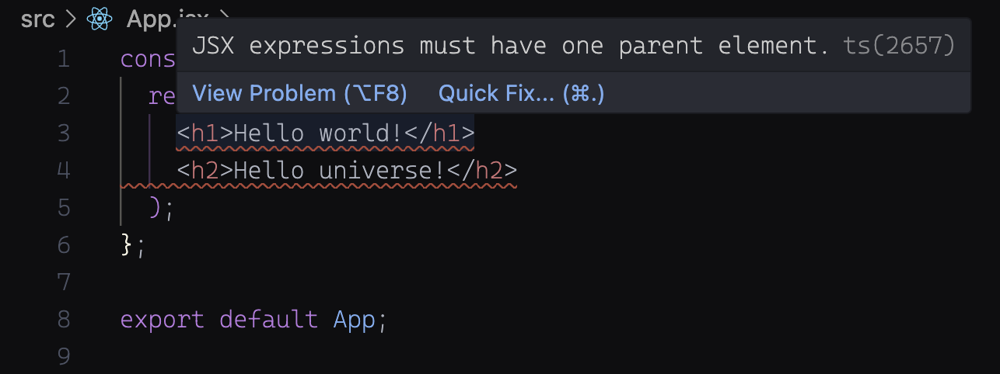

# 

**Learning objective:** By the end of this lesson, students will be able to tktk

## JSX Fundamentals

When creating apps, developers typically separate structure (markup) and logic into separate files. This does a nice job of keeping a separation of concerns, but it can also add time and complexity to the development process. 

JSX is a syntax extension for JavaScript that lets you write HTML-like markup inside a JavaScript file, making it faster and easier to build complex user interfaces. 

## JSX Pitfalls

Because the basic structure of JSX is so similar to HTML, it's easiest to examine it by highlighting the few places where its behavior differs.

### Returning a single element

Elements must be wrapped in a single parent tag. You can see this for yourself, in `App.jsx` add an `<h2>` below the existing `<h1>`:

```jsx
// src/app.jsx

const App = () => {
  return (
    <h1>Hello world!</h1>
    <h2>Hello universe!</h2>
  );
};
```

After this change, you'll see a resulting error:



This is ultimately because what is being written here is being executed as JavaScript (even if it looks like HTML). Functions in JavaScript can only return a single thing, so we need a way to bundle multiple elements together inside of a single element:

```jsx
// src/app.jsx

const App = () => {
  return (
    <div>
      <h1>Hello world!</h1>
      <h2>Hello universe!</h2>
    </div>
  );
};
```

Now we're error free, but in this process we've added a `<div>` element that we didn't really need for any purpose other than to make our application run. While this isn't the worst thing, it's not ideal either. To solve this problem, we can add a special element in React called a [Fragment](https://react.dev/reference/react/Fragment). 

Fragments wrap around elements so that we can bundle them, just like what we accomplished with the `<div>` above. Check it out:

```jsx
// src/app.jsx

const App = () => {
  return (
    <>
      <h1>Hello world!</h1>
      <h2>Hello universe!</h2>
    </>
  );
};
```

These special elements don't result in any new HTML being added to the page, so you should use them when you want to bundle things together so that you can return them all together, but don't want to create any resulting HTML as a result of that bundling.

### Tags must be explicitly closed

In JSX, tags must be closed, and are not self-closing. For example, elements like the `<hr>` horizontal rule element that would be self-closing in HTML must be closed with a `/` before its closing `>` as shown here:

```jsx
// src/app.jsx

const App = () => {
  return (
    <>
      <h1>Hello world!</h1>
      <h2>Hello universe!</h2>
      <hr />
    </>
  );
};
```

### camelCasing element attributes

As mentioned above, JSX turns into JavaScript. Any attributes written in JSX will become keys of JavaScript objects, and these keys will have the same limitations that any JavaScript variable name does. For example, in JavaScript `class` is a reserved word, so we have to account for that when composing JSX as well.

In html we could write: 
```html
<div class="container"> </div>
```

but in JSX we would use [className]([className](https://developer.mozilla.org/en-US/docs/Web/API/Element/className#notes) ) - camelCased - instead:
```JSX
<div className="container"> </div>
```

JavaScript also forbids the use of dashes in variable names, so you'll notice that any attributes that use a dash in HTML are written camelCased in JSX.
